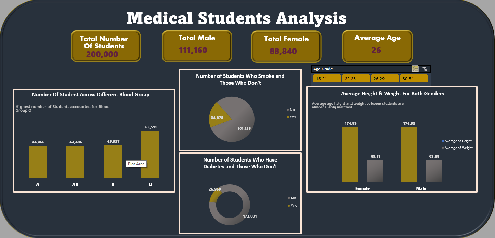

# Medical Students Analysis

## Introduction
This is an assignment to analyse medical students health records in relation to their social lifestyle

**_Disclaimer_**: _All dataset does not represent any company, institution or country but a dummy dataset to demonstrate capabilities of Microsoft excel._

## Problem statement
 i).Show the average number of student age within the school

 ii).Total number of students by gender

 iii). Average weight and height of Students

 iv). Number of Student across different blood group

 v). Number of student who smoke and those who don't

 vi). Number of students who have diabetes and those who don't

## Skill/ Concepts Demonstrated

The following Microsoft excel skills were incorporated- 

- Data filtering
- Sorting Data
- Data cleaning
- Filling of blank cells
All blank values with text data type was replaced with mode text value of their fields.
All blank values with numeric data type was replaced with the average number of their respective fields.

## Pivot Table Visual

## Medical Students Analysis Chart

 

